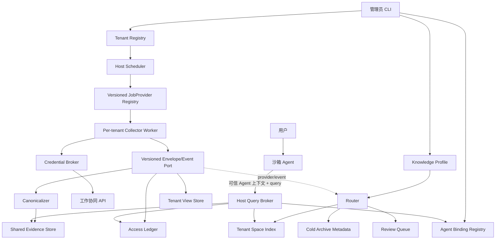

# PR-001：CWK 多租户共享证据与专题知识空间详细设计

> 状态：RT-011～RT-016 completed；按剩余工作执行冻结，下一波并行启动 **RT-017 + RT-022**；
> **RT-019 不是第三条并行链**，必须等 RT-017 完整、不可再拆的 Stage-01
> compatibility surface 独立验收 PASS 之后才能开工
> 版本：0.1.0
> 日期：2026-08-19
> 对应需求：`PRD.md`
> 安全附件：`references/安全威胁模型.md`

## 1. 设计结论

首期采用“宿主机数据面 + 沙箱查询客户端”的本地多租户架构：

- Gateway 机器安装一套 CWK 引擎；
- 每租户独立采集身份、状态、锁、日志、重试和知识配置；
- 相同工作协同汇报版本写入一份共享、不可变的 canonical evidence object；
- 每租户保存独立 access grant 和 tenant view；
- 每租户可以有多个逻辑 knowledge space，空间只保存派生投影和索引；
- 普通沙箱不挂载共享 raw，通过宿主机 Query Broker 查询；
- Query Broker 从可信 Agent 上下文解析 tenant，在召回前和 raw 回读前执行两次 ACL；
- AI 生成的 knowledge profile 先成为 proposal，用户确认后才激活；
- 低价值内容使用 `archive_no_index`，不默认物理删除；
- 现有单用户 Local-First 流程保留，在影子迁移和门禁完成前不切换生产。

## 2. 设计原则与不变量

### INV-01：共享存储不产生共享权限

共享对象的存在、object ID、哈希、标题、大小和命中数量均是受控信息。普通 Agent 无法列举共享目录或直接探测对象。

### INV-02：tenant 由可信身份决定

外部查询协议不接受 `tenant_id`、`mirror_root`、raw 路径或 credential reference。tenant 只能由 Gateway 认证上下文中的 Agent ID 经宿主机 binding registry 解析。

### INV-03：ACL 必须双重执行

第一次在候选生成前过滤，避免泄漏标题、数量和存在性；第二次在每次 evidence 回读前重新验证，防止旧索引、旧缓存和并发撤权绕过权限。

### INV-04：原始证据不可变

canonical object 写入后不覆盖。正文变化产生新的 report version。所有派生知识记录对象和 profile 的哈希引用。

### INV-05：用户配置不能扩权

knowledge profile 只能影响路由、实体、空间、排序和派生知识，不能创建 access grant、修改 Agent 绑定、指定路径或改变 tenant。

### INV-06：未知或过期权限 fail closed

未知 Agent、suspended tenant、过期 binding、过期 grant、哈希失败、profile 不可验证、路径异常均拒绝查询或采集，不回退到全局 `.env`、全库搜索或其他 tenant。

### INV-07：冷归档不是删除

分类器只能停止精编、索引和持续展示。物理删除由独立数据保留策略控制。

## 3. 总体架构



### 3.1 信任区

1. **Sandbox zone**：普通 Agent；无 AppKey、无共享 raw、无 tenant root。
2. **Host service zone**：Query Broker、Scheduler、Collector、Credential Broker；由专用服务账号运行。
3. **Shared evidence zone**：不可变正文和版本目录；仅 Host service 可读写。
4. **Tenant data zone**：各 tenant 的访问关系、空间索引、profile、状态和缓存。
5. **Admin zone**：tenant/binding/secret reference 管理；不通过普通查询接口读取正文。
6. **External source zone**：工作协同 API；返回内容视为数据，不是指令。

## 4. 目录布局

```text
CWK_INSTANCE_ROOT/
├── shared/
│   ├── objects/aa/<opaque-object-id>.json
│   ├── report-versions/<source_namespace>/<report_id>/catalog.jsonl
│   ├── canonical-events/<source_namespace>/<report_id>/
│   └── staging/
├── registry/
│   ├── tenants/<tenant_id>.json
│   ├── agent-bindings/<agent_id_hash>.json
│   ├── access-ledger/<tenant_id>/grants.jsonl
│   └── credentials/<tenant_id>.ref
├── tenants/<tenant_id>/
│   ├── config/
│   │   ├── tenant.json
│   │   ├── active-profile.json
│   │   ├── profiles/<version>.json
│   │   └── spaces/<space_id>.json
│   ├── views/<source_namespace>/<report_id>.json
│   ├── routes/<source_namespace>/<report_id>.json
│   ├── knowledge-spaces/<space_id>/
│   │   ├── summaries/
│   │   ├── topics/
│   │   ├── entities/
│   │   └── _system/
│   ├── indexes/<space_id>/
│   ├── review/
│   ├── archive/
│   ├── state/
│   ├── runs/
│   ├── locks/
│   ├── retries/
│   ├── cache/
│   └── logs/
├── audit/
├── backups/
└── runtime/
    └── query-broker.sock
```

目录规则：

- `tenant_id`、`space_id` 和 object ID 均是经过验证的 opaque ID，不使用用户名、标题或用户输入作为路径。
- shared、registry、tenant root、cache 和 logs 根目录不得是软链接。
- 普通查询 API 不接受任何路径。
- 实现层优先使用目录句柄和 `O_NOFOLLOW`；无法使用时至少在创建、打开和 rename 前后验证 containment 和 inode。
- 文件默认权限：shared/registry/audit `0700`，敏感文件 `0600`；具体用户/组由部署环境决定。

## 5. 核心组件

### C-01：Instance Layout Resolver

职责：

- 解析 `CWK_INSTANCE_ROOT`；
- 生成 shared/tenant/registry 受控路径；
- 验证 ID 格式、根目录权限、无软链接和 containment；
- 提供原子写、不可变写和租户临时目录；
- 禁止代码继续拼接仓库级 `runs/`、`state/` 作为多租户默认值。

首期接口：

```python
layout = InstanceLayout.open(instance_root)
tenant = layout.tenant(tenant_id)
tenant.state_file("collection.json")
layout.shared.object_path(object_id)
```

### C-02：Tenant Registry

职责：tenant 创建、状态机、配额、profile 指针、auth epoch、审计。

Tenant 状态与权限以 PRD FR-02 为唯一契约，禁止引入 `enabled/disabled` 别名：

```text
draft -> profile_pending
profile_pending -> pilot | suspended | offboarded
pilot -> active | suspended | offboarded
active -> suspended | offboarded
suspended -> profile_pending | pilot | active | offboarded
offboarded -> (terminal)
```

- `draft` 只有 admin 配置；不解析凭据、不运行数据面。
- `profile_pending` 只允许有界按需样本采集与 Profile Proposal/Preview；不开放普通查询或常态 Scheduler。
- `pilot` 只对 allowlist 开放采集、Scheduler、Profile 和 Broker。
- `active` 开放正常租户数据面。
- `suspended/offboarded` 均禁止凭据解析、采集、Scheduler 和查询；`offboarded` 为终态。
- 从 `suspended` 恢复时必须重新校验目标状态的全部 receipt，不能复用旧 in-flight 工作。

租户记录：

```json
{
  "schema": "cwk.tenant.v1",
  "tenant_id": "t_...",
  "status": "profile_pending",
  "credential_ref": "secret://...",
  "active_profile_version": null,
  "auth_epoch": 1,
  "created_at": "...",
  "updated_at": "..."
}
```

### C-03：Agent Binding Registry

职责：把可信 Agent 身份固定映射到 tenant；管理 binding epoch、启用/撤销、重复绑定冲突和审计。

绑定记录只保存 HMAC 后的不可反解 `agent_id_hash`：

```json
{
  "schema": "cwk.agent_binding.v1",
  "agent_id_hash": "hmac-sha256(binding_secret, agent_id)",
  "tenant_id": "t_...",
  "binding_epoch": 3,
  "status": "active",
  "bound_at": "...",
  "revoked_at": null
}
```

- `binding_secret` 由宿主机 secret backend 管理，管理员可轮换；轮换必须一次性重算全部记录并推进所有 tenant `auth_epoch`。
- 原始 `agent_id` 只在 Gateway 认证边界短暂存在，绝不写入磁盘、日志、审计、缓存键或错误栈；进入 Registry 前立即 HMAC，之后按 opaque 处理。
- 普通查询响应永不回显原始 `agent_id`、`tenant_id`、`agent_id_hash`、`binding_epoch` 或宿主机路径。
- 绑定变更（bind/rebind/revoke/secret 轮换）触发对应 tenant `auth_epoch` 递增，令 in-flight 请求在 raw 回读前复核阶段被拒。

### C-04：Credential Broker

职责：按 tenant 的 credential reference 获取 AppKey，注入单次 Collector 进程的最小环境并在退出后释放。

强制条件：

- 不允许 `--app-key <value>` 出现在多租户命令行；
- 不继承整个宿主机环境；
- 不把密钥写入 config/manifest/log/prompt；
- `draft/suspended/offboarded` 拒绝发放；`profile_pending` 仅允许有界样本采集，`pilot/active` 才允许相应数据面作业；
- 不允许找不到租户密钥时回退到仓库 `.env`。

Secret backend 通过接口适配，首期可提供环境变量引用/系统 Keychain 适配器，但测试只使用假的 memory/file reference，不写真实密钥。

### C-05：Per-tenant Collector Worker

职责：使用本 tenant 身份发现可见汇报、拉取正文和用户视角，并发布 `CanonicalEnvelope`、`TenantViewEnvelope`、`AccessObservation`、以及 tenant-scoped staged event evidence。Collector 不直接调用尚未实现的 Router/Projector；后续消费者通过版本化接口订阅。

现有 `cwk_collect_live.py` 作为源端适配基线，但需要把输出拆为：

```python
CanonicalEnvelope
TenantViewEnvelope
AccessObservation
TenantEventEvidenceEnvelope (tenant-scoped, staged only)
```

#### C-05a：Wave-0 neutral PilotAdmission ABI

Pilot allowlist 不从 TenantRegistry、环境变量、CWD 或 RT-026 私有配置推断；所有 consumer
只依赖中央冻结的 `PilotAdmissionProviderV1`：

```python
class PilotAdmissionProviderV1(Protocol):
    API_VERSION = "cwk.pilot_admission_provider.v1"
    @property
    def purpose(self) -> str: ...
    def snapshot(
        self, *, agent_snapshot: AgentContextSnapshot
    ) -> PilotAdmissionSnapshotV1: ...
```

- provider 在构造期绑定 `collector_run | profile_workflow | query_broker`；调用方法没有
  `purpose=` 参数。
- snapshot 字段恰好为 `schema,tenant_id,purpose,admitted,
  admission_policy_revision,admission_policy_sha256,as_of,expires_at,snapshot_sha256`；
  `0 < TTL <= 300s`，`as_of <= now < expires_at`。
- `snapshot_sha256 = SHA256(b"cwk-pilot-admission-snapshot-v1\0" + JCS(
  snapshot excluding only snapshot_sha256))`。这只是完整性绑定，权威性仍来自注入的
  provider；Null provider 稳定返回 `unavailable`。
- 只有 tenant status=`pilot` 强制 `admitted=true`；`profile_pending/active` 不因该 ABI
  改变原状态权限。Collector/Scheduler 用 `collector_run`，Profile/Router/Projector 用
  `profile_workflow`，Broker 用 `query_broker`。
- 三件 neutral 工件由 Wave-0 中央控制面冻结，不属于任何 RT owner：
  `scripts/cwk_pilot_admission_api.py`（SHA-256
  `2bc26ff3b2b71bcfc1d3a5d7fba4a0cca99392a63837a62186086c9f6e817900`）、
  `contracts/cross_rt/schemas/pilot_admission_snapshot_v1.schema.json`（
  `af003563cff163350e2b0ef458a9c5029b0d4330a559779ec0464055aebcc6a6`）、
  `tests/test_pr001_pilot_admission_contract.py`（
  `1416d8d273868b91eeb0f0f563a1e3103cba8ec27c8a15d5209dd6eb1395386e`）。

RT-023 只能提供与 production factory 物理分离的 non-production sandbox adapter，不能
用于 VG-D/G5 的 production claim；RT-026 是唯一 production adapter owner，必须从
release switch、有效 G7、target environment/instance、component flags 与 tenant
allowlist 推导，off/shadow/过期/撤销/坏配置全部拒绝。

### C-06：Canonicalizer

职责：从源端响应中提取跨用户稳定候选字段，规范化 JSON，计算哈希，生成不可变对象和 report version。

保守共享规则：

- 默认共享：source namespace、report_id、标题、正文、作者、源端创建/更新时间和稳定字段。
- 默认 tenant overlay：lane、read/todo/newReply、角色、允许操作、**评论（reply）、审批/事件节点（node）、附件元数据、附件临时 URL、可见事件集合**。
- 上述 overlay 字段在通过双身份差异验证并写入 `verified_shared_extensions` 清单之前，一律不进入 canonical evidence object 与 report version catalog。

`verified_shared_extensions` 升级流程（对应 PRD FR-07）：

1. 使用 `cwk contract compare-user-views` 在两个真实身份下的 ≥50 篇共同可见样本上比较目标字段；
2. 差异率、命中率与语义一致性达到阈值后，生成 `verified_shared_extensions_v<N>` 清单草稿，附证据引用；
3. 独立审核批准后写入版本化清单（不可变、带 SHA-256）；
4. Canonicalizer 只在 clean-shared 集合与 `verified_shared_extensions_v<N>` 明确列出的字段上写 canonical；
5. 未在清单中的字段以及所有临时 URL（attachment presign / preview / 短链）**永不进入 canonical**，即便被判定内容一致——它们本身含租户 token 或时间敏感状态；
6. 未知/新增字段默认丢入 overlay，永不写 canonical。

规范化禁止：

- 删除有业务意义的空白或标点；
- 将不同 report_id 仅因正文相同而错误视为同一报告；
- 保存任何临时下载 URL（无条件禁止）；
- 混入采集时间、tenant、读取状态等导致哈希不稳定的字段。

### C-07：Shared Evidence Store

职责：写入和回读不可变对象，维护 report version catalog。

身份键：

```text
report_key = source_namespace + report_id
version_key = report_key + canonical_sha256
object_id = "o_" + base32(random 128 bit)
```

SHA-256 用于完整性，不作为对外 object ID，也不提供 hash existence API。

并发写入流程：

1. 在 shared staging 写临时文件；
2. 计算/复核 SHA；
3. 获取 report version 细粒度锁或 CAS；
4. 若相同 version 已存在，复核对象 SHA 后复用；
5. 否则原子发布对象，再追加 catalog；
6. catalog 发布失败时对象可作为未引用垃圾回收候选，不能形成半引用。

### C-08：Access Ledger

职责：记录 tenant 对 report 的有效授权，作为查询权限唯一 SoR。

```json
{
  "schema": "cwk.access_grant.v1",
  "tenant_id": "t_...",
  "source_namespace": "cwork",
  "report_id": "...",
  "status": "active",
  "roles": ["receiver"],
  "visibility_scope": "full",
  "permission_source": "tenant_appkey_observation",
  "auth_epoch": 4,
  "granted_at": "...",
  "last_verified_at": "...",
  "lease_expires_at": "...",
  "revoked_at": null
}
```

权限状态：

```text
discovered -> granted -> active -> revalidation_due -> active|revoked
revoked   -> purge_pending -> purged
```

- 只有 `active` 允许作为候选来源。`discovered / granted(未激活) / revalidation_due(过期未复核) / revoked / purge_pending / purged` 全部 fail closed。
- `revalidation_due` 期间的“宽限可读”被明确禁止。
- 没有权威撤销事件时使用不超过 15 分钟的 lease 定期复核；复核失败立即降级为 `revalidation_due` 并进入拒答。
- RT-017 的 `CWorkAuthorityProvider` 只通过 Credential Broker 获取当前 tenant 的短租约凭据；只读 ABI 固定为 `observe_visible(cursor)`、`verify_grant(report_key)`、`consume_revocations(cursor)`，并区分 `ALLOW / EXPLICIT_DENY / NOT_FOUND / TRANSIENT_UNKNOWN / AUTH_FAILURE / SCHEMA_ERROR`。只有后端明确承诺为权威语义的 `ALLOW` 可签发不超过 15 分钟的短 lease receipt；明确 deny/revoke 立即撤权，其余状态全部 fail closed。bounded list 缺项不是撤权，现有关系观察接口也不能冒充 ACL 权威源。
- SLA 首期采用“安全默认 + 后续基准替换”表述（对应 PRD FR-08）：撤权事件下逻辑拒绝 ≤60s 目标、派生清理 ≤5min 目标；RT-011 只验证权威能力，最终值在 RT-024 实测并于 RT-026 试点 go/no-go 引用前不虚构指标。

RT-017 的 `list_profile_eligible(*, snapshot)` 不从 grant/view 私自填充 current canonical
SHA。它必须注入 `CanonicalVersionProviderV1`，对每个 eligible `report_key` 调用
`resolve_current(*, report_key)`，再由 provider 通过 RT-014 公开
`SharedEvidenceStore.read_version(report_key, canonical_sha256)` 验证对象。返回快照字段
恰好为 `schema,report_key,canonical_sha256,catalog_revision,catalog_head_sha256`；禁止
枚举 catalog、调用 RT-014 私有 `_read_*`、或返回 path/object_id。冻结工件：
`scripts/cwk_canonical_version_provider.py`（
`4e6ec4ee88b5b23ebda160ccfb5dd60ee0c39092ca26e2247cf3caae67e1f518`）、
`contracts/rt017/schemas/canonical_version_snapshot_v1.schema.json`（
`dca2aceaad46fba973eb51d3ee7c4faa2350dc5191ac1af711cdb66f6bc6a3b3`）、
`tests/test_rt017_canonical_version_provider.py`（
`aab334e40e36cdb2f48ec2178393921dc91dae585675d28a952065250434dc06`）。

### C-09：Tenant View Store

职责：保存每租户不同的 lane、read/todo/newReply、角色、允许操作、可见事件和附件权限覆盖。

Tenant view 引用 canonical version，不复制正文：

```json
{
  "schema": "cwk.tenant_view.v1",
  "report_key": "cwork:...",
  "canonical_sha256": "...",
  "lane": "received",
  "read_status": "unread",
  "todo_status": "pending",
  "visible_event_ids": [],
  "attachment_permissions": [],
  "observed_at": "..."
}
```

### C-09a：Tenant Event Evidence Staging

职责：完整保留对当前 tenant 可见、但尚未通过双身份一致性验证的评论、回复和审批正文，避免它们在采集时被静默丢弃。它是 tenant 私有的受控宿主机暂存层，**不是** Access Ledger 的权限来源、不是 shared raw、不是 `TenantViewEnvelope` 扩展，也不是 Query、Router、AI 或索引入口。

每条记录使用 RT-017 自有的 `cwk.tenant_event_evidence.v1` 契约，至少包含 opaque `event_key`、`report_key`、父 canonical SHA、受限枚举 event type、允许字段提取的 author/time/body、body SHA、去自身 hash 后的 event SHA、extractor version 和固定的 `stage_state="staged"`。禁止保存原始 source event ID、整段源 payload、附件/预览 URL、token、credential、Agent/binding/auth epoch、tenant 或宿主机路径；正文按 NFC 和严格长度/内容 allowlist 校验，歧义、HTML/URL/token、未知字段或超长内容进入 review，不能截断后静默发布。

写入前 Collector 必须通过 RT-014 的公开 reader 校验父 canonical；记录采用 tenant-scoped opaque 路径、dirfd + `O_NOFOLLOW`、原子写/CAS 与每 event 锁，目录/文件权限分别为 `0700/0600`。相同事件的正文变化生成新的不可变 evidence，不能覆盖旧件；本轮列表中缺失不能推断撤权、删除或不可见。

没有权威 receipt 时，staged evidence 只能安全保存，不能写入 `TenantViewStore`、不能成为 query/router/index/AI 输入。后续消费者仅在同时满足 active grant、未过期 lease、当前 `visible_event_ids` 显式引用该 `event_key`（或未来权威 event-level receipt）时才可读取，并在读前后复核 ACL。撤权后先由 ledger fail closed，再由 RT-017 注册的 cleanup consumer 幂等清理 staged body、写 purge receipt 后 ack；不得复活已撤权 evidence。

### C-10：Knowledge Profile Service

职责：分层抽样、生成 proposal、用户确认、holdout 预览、激活、影响分析和回滚。

Profile 版本状态固定为：

```text
draft -> proposed -> preview -> confirmed -> active
active -> superseded
superseded -> active  (仅通过 profile_pointer_rollback)
```

不存在 `rolled_back` 版本状态。回滚必须以追加式 `profile_pointer_rollback` 事件原子切换 tenant 的 active pointer，同时把当前 active 版本置为 `superseded`、目标版本置为 `active`；版本内容、确认记录和历史事件保持不可变。

Profile 允许字段白名单：

- `spaces`；
- `entity_policy`：颗粒度、confirmed aliases、confirmed merge/split；
- `attention`：重点对象、来源、类型；
- `routing_rules`；
- `archive_rules`；
- `query_preferences`；
- `model_policy` 和预算（不能指定任意命令或工具）。

Profile 禁止字段：tenant_id、agent binding、credential、路径、access grant、shared object、任意 shell/prompt 模板。

### C-11：Router

职责：依据 active profile 把 tenant 可见 report 多标签路由到 spaces，或冷归档/待确认。

决策顺序：

1. 安全/权限先决条件；
2. 用户显式 include/exclude 规则；
3. confirmed entity/alias 规则；
4. 结构化来源/类型规则；
5. AI 分类建议；
6. 阈值和冲突策略。

伪代码：

```python
if not active_grant(report):
    return REVOKED
matches = deterministic_rules(report, profile)
entity_matches = confirmed_entities(report, profile)
ai = classify_only_if_needed(report, profile)
decision = combine(matches, entity_matches, ai)
if decision.conflict or decision.confidence < profile.review_threshold:
    return review(reason_codes=...)
return route(disposition=decision.disposition, space_ids=dedupe(decision.space_ids))
```

AI 失败、超时、输出不合约一律进入 review 或按确定性规则执行；不能把失败解释为 archive。

### C-12：Knowledge Space Projector

职责：为每个 tenant/space 生成可重建的 summary、topics、entities、index、daily/action/risk views。

- 空间由稳定 opaque `space_id`（如 `sp_...`）标识；用户可读 slug（`tbs`、`sfe`）只是 tenant 配置中的 UI 别名。所有派生投影、审计、路由决策、缓存键、目录路径 `knowledge-spaces/<space_id>/` 均使用 opaque ID；slug 改名不影响任何持久化产物。
- 首期空间不嵌套；每 tenant 最多 32 个空间。状态固定为 `active | disabled`。slug 为 tenant 内唯一的 lowercase ASCII `^(?=.{1,32}$)[a-z](?:[a-z0-9-]*[a-z0-9])?$`，禁止尾部 `-`，并保留 `all/shared/raw/system/archive/review`；只有已确认 Profile activation 或宿主机 admin 可创建，沙箱不能直接创建。
- 每个派生文件记录 tenant internal ID、`space_id`、canonical_sha256、profile_version/profile_sha256 和生成器版本。
- 同一 report 可被多个 space 投影，但事实字段引用同一 canonical evidence。
- 空间特有的“为何重要”“专题解释”与基础事实分栏保存。
- space 停用只撤销投影和索引，不删除 canonical raw 或 access grant。

### C-13：Host Query Broker

职责：为沙箱 Agent 提供受控查询，不暴露共享文件系统。

请求逻辑字段（沙箱侧调用参数，不含 tenant/agent/路径）：

```json
{
  "query": "TBS 下一步计划和风险",
  "space_selector": ["sp_5a92f7c1b3"],
  "include_dispositions": ["index"],
  "time_filter": null,
  "limit": 8
}
```

- `space_selector` 是 opaque `space_id` 数组。用户可读 slug（如 `tbs`）不得由沙箱本地读取 tenant 配置解析；RT-023 通过同一可信身份链提供固定的三个 Tool operation `query`/`list_spaces`/`resolve_slug`，Broker 请求只接受 `list_spaces`/`resolve_slug` 返回的 opaque ID。`resolve_slug` 是独立只读入口，只接受严格 `{slug}` 对象，slug 做严格 lowercase ASCII 字节匹配（不 lower/casefold/NFC/NFKC/去空白），变体一律按"不存在"等价拒绝；slug 不得混入 QueryRequest。
- 缺省 `space_selector` 使用 active Profile 的默认 active space 集；显式空数组非法。`include_dispositions` 默认 `["index"]`，显式空数组非法；可显式加入 `archive_no_index` 或 `review`。`time_filter.from` 必须不晚于 `to`。
- 请求体不允许出现 `tenant_id`、`agent_id`、`credential_ref`、`mirror_root`、绝对路径、`auth_epoch`、`profile_version` 等身份/权限字段。

传输与身份：

- **政策/ADR（G1）**：首期强制 OpenClaw 原生受控 Tool plugin factory，Agent 身份由 Gateway 通过 tool execution context 注入；请求体身份字段必须递归拒绝。HTTP `/tools/invoke` 允许 operator 请求体选择 Agent，不属于本身份边界，不得用作沙箱查询通道。G1 只冻结政策、默认和能力探针，真实运行时合规由 RT-023、VG-D、G5 验收。
- **后备本机实现**：Unix domain socket + `SO_PEERCRED`（或等价 peer credential，例如 macOS `LOCAL_PEERCRED`）。socket 权限 `0600`，位于 `runtime/query-broker.sock`。仍不接受请求体中的 `agent_id`；由 kernel 提供的 peer uid/pid 映射到宿主机 secret backend 中登记的可信 Agent 身份。
- **禁止**：loopback HTTP + 请求体自报 `agent_id`、共享共享目录挂载、任何依赖用户输入声明租户的方案。这些方案任何时候都不满足 G1，即使加签名也不接受。

处理序列：

1. 从传输层可信元数据取 Agent 身份，立即 HMAC；请求体身份字段一律拒绝；
2. 通过 `agent_id_hash` 查询 Binding Registry，加载 `tenant_id`、`binding_epoch`、`status`；non-active fail closed；
3. 加载 tenant `status`、`auth_epoch`；只有 `pilot/active` 允许继续。`active` 对
   PilotAdmission 调用 0 次；`pilot` 在读取 Profile、检索或 cache lookup 前以构造期绑定
   `purpose=query_broker` 的 provider 做第一次准入快照。Profile 与 space 事实随后通过
   **一次**注入式调用 `ProfileSpaceSnapshotProviderV1.snapshot(agent_snapshot)` 获取（见
   下方 ABI 冻结），并记录
   `req_snapshot = {auth_epoch,binding_epoch,profile_sha,space_ids,membership_versions,
   index_versions,tenant_status,admission_policy_revision,
   pilot_admission_snapshot_sha256}`；
4. 缺省 `space_selector` 展开为 `default_space_ids`；显式 `space_selector` 必须是 `queryable_space_ids` 的子集，否则按存在性等价的 `access_denied` 拒绝；
5. 从 Access Ledger 得到该 tenant 的 active grant 集，与 space membership 取交集，形成不可越权候选域；
6. 仅在候选域对应的 tenant space index 中执行召回；旧索引中无授权的标题/数量/时序不得进入检索器；
7. 对 Top-K 每个 report 再次读取 Binding + Tenant + Grant，**复核 `req_snapshot` 与当前值一致**，任一不一致（例如 in-flight 撤权导致 `auth_epoch` 递增）立即拒绝整次请求；
8. `pilot` 在上述 fresh context/grant/profile 复核后、EvidenceReader 前执行第二次
   PilotAdmission；cache hit 也不得跳过两次准入。deny/unavailable 不缓存；revision
   high-water 回退或两次 policy/snapshot 漂移都拒绝整次请求；
9. 回读 shared object并验证 SHA；
10. 生成 evidence bundle；
11. 可选让回答模型仅基于 evidence bundle 组织答案；
12. 输出证据、截至时间和安全状态，写审计记录（只记 hash、长度、意图分类、授权 report id、`req_snapshot`）。

`index`、`archive_no_index`、`review` 各自使用独立 `limit`、timeout 和 concurrency；冷归档默认 limit 不高于普通 index 的一半，并禁止共享 raw 全扫描。

**`ProfileSpaceSnapshotProviderV1` 单一所有权（并行 ABI 闭包）**：Broker 不读 Profile/Space 的私有磁盘布局，也不 import `cwk_knowledge_profile.py`/`cwk_space_registry.py`/`cwk_space_projector.py`；Profile 与 space 视图只经**构造注入**的 provider 获得。

```python
API_VERSION = "cwk.profile_space_snapshot_provider.v1"

class ProfileSpaceSnapshotProviderV1(Protocol):
    API_VERSION = "cwk.profile_space_snapshot_provider.v1"
    def snapshot(self, agent_snapshot: AgentContextSnapshot) -> ProfileSpaceSnapshotV1: ...
```

- **owner = RT-022**（ABI + `cwk.profile_space_snapshot.v1` schema），**生产 adapter = RT-021**（零漂移消费，不得 fork/扩展/收窄或重定义同名 schema）。RT-022 只用 fake provider，可与 RT-019/021 并行开发。
- 单次调用一次性返回 `profile_sha256`、`profile_version`、`default_space_ids`、`queryable_space_ids`、`membership_versions`、`index_versions`、`as_of`、`snapshot_sha256`；禁止 per-space 回调或 N+1。它取代了 `SpaceIndexProvider.list_active_spaces/versions`，后者只保留 `retrieve`，避免同一事实双 owner。
- 不变式由 Broker 侧强制（provider 不可信）：`default_space_ids ⊆ queryable_space_ids`；两个 versions 映射的键集合精确等于 `queryable_space_ids`；违反、出现未知 space ID 或返回 slug/路径/正文/credential/他租户 ID 即 provider corruption，拒绝整次请求。
- **0 space 不是特例路径**：即使没有任何可查询 space，返回值仍必须携带非空 `profile_sha256` 并进入 `req_snapshot` 与 cache key；随后按正常授权语义得到空候选域，映射为与未授权字节等价的 `access_denied`。
- 二次 ACL 阶段重新调用一次并逐字段比对；任何漂移即整次请求 fail closed，不返回部分 bundle。

本节的授权/检索核心由 RT-022 实现；OpenClaw Tool/UDS transport、`list_spaces`、沙箱 client 与真实 SpaceIndexProvider 由 RT-023 实现。Broker 不提供 break-glass、跨 tenant 读取或“管理员模拟用户”通道。

### C-14：Tenant Scheduler

职责：按 tenant 状态、配额和错峰策略启动版本化 Worker/JobProvider。RT-018 只依赖稳定 provider 接口，不直接依赖尚未交付的 RT-021 Projector；Projector 就绪后作为 provider 注册。

- 每租户独立单写锁；
- 全局只控制资源公平，不保存业务状态；
- 采集、AI、DocDB 分别设置并发和预算；
- 一个 tenant 429、超时、坏 profile 或磁盘配额超限时单独熔断；
- 只有 `pilot/active` 可由常态 Scheduler 启动新任务；`profile_pending` 的样本采集由有界按需入口触发；`draft/suspended/offboarded` 均不得启动。

### C-15：Audit and Metrics

职责：追加式安全审计、租户健康指标、成本与容量基准，由 RT-024 实现。

### C-16：Backup and Recovery

职责：加密备份、密钥分离、clean-room 恢复与 RTO/RPO 实测，由 RT-025 实现。

日志不记录：AppKey、完整 raw、完整自然语言 query、临时附件 URL、宿主机敏感路径。

## 6. 数据契约

### 6.1 Canonical evidence envelope

```json
{
  "schema": "cwk.canonical_report.v1",
  "source_namespace": "cwork",
  "report_id": "207...",
  "title": "...",
  "author": {"source_user_id": "...", "display_name": "..."},
  "created_at": "...",
  "source_updated_at": "...",
  "body": "...",
  "canonical_sha256": "...",
  "normalizer_version": "v1"
}
```

对象中不出现 tenant、lane、read/todo、allowedActions、reply/node/attachment、临时 URL、credential 或本地路径。附件在双身份验证与 `verified_shared_extensions_vN` 获批前全部进入 tenant overlay；若未来升级，catalog 必须同时记录 extension manifest 的 version 与 SHA，v1 示例不预置附件字段。

### 6.2 Report version catalog entry

```json
{
  "schema": "cwk.report_version.v1",
  "report_key": "cwork:207...",
  "canonical_sha256": "...",
  "object_id": "o_...",
  "first_seen_at": "...",
  "source_updated_at": "...",
  "normalizer_version": "v1"
}
```

### 6.3 Route decision

```json
{
  "schema": "cwk.route_decision.v1",
  "tenant_id": "t_...",
  "report_key": "cwork:207...",
  "canonical_sha256": "...",
  "disposition": "index",
  "space_ids": ["sp_5a92f7c1b3", "sp_7d11ac90ef"],
  "confidence": 0.93,
  "reason_codes": ["confirmed_entity:tbs", "confirmed_entity:sfe"],
  "evidence_refs": [],
  "profile_version": "v1",
  "profile_sha256": "...",
  "decided_by": "deterministic+model",
  "decided_at": "..."
}
```

### 6.4 Knowledge profile

```json
{
  "schema": "cwk.knowledge_profile.v1",
  "version": "v1",
  "status": "active",
  "spaces": [],
  "entity_policy": {},
  "attention": {},
  "routing_rules": [],
  "archive_rules": [],
  "review_threshold": 0.75,
  "sample_manifest_ref": "...",
  "holdout_manifest_ref": "...",
  "confirmed_by": "user",
  "confirmed_at": "...",
  "profile_sha256": "..."
}
```

`status` 只能取 C-10 定义的六个版本状态；回滚由独立审计事件表达，不得把 `rolled_back` 写入 Profile。

## 7. 用户知识方案共创算法

### 7.1 分层抽样

目标样本默认 150，允许 100–200。按以下维度分桶后做确定性采样：

- 时间（月/周和最近活跃）；
- source lane；
- 发送人/组织；
- 标题/汇报类型；
- 正文长度；
- 回复/审批活跃度；
- 已知实体/无实体；
- 当前 fallback/AI summary 状态。

采样 manifest 记录随机种子、候选总数、分桶数量、入样 report_key 和 canonical SHA。holdout 从剩余集合按相同分层选 20–30 篇，禁止重叠。

### 7.2 Proposal 生成

AI 只接收当前 tenant 已授权样本的 evidence bundle，并输出固定 schema：

- 推荐空间及覆盖样本；
- 关键实体、别名、可能合并/拆分；
- 重要/低价值类别；
- 用户常见问题模板；
- 路由规则建议；
- 每项置信度、影响篇数和逐字证据。

分批与聚合（针对 100–200 篇样本）：

1. 采样阶段将样本分为若干 chunk（默认每 chunk 20–30 篇，可按 token 预算调整），单次 AI 调用只处理一个 chunk；
2. 每个 chunk 输出 `partial_proposal_v1`（同一 schema，字段带 chunk 覆盖率与证据引用）；
3. 聚合器将所有 `partial_proposal_v1` 用确定性 reducer 汇总：合并同名实体/别名、加权投票路由规则、汇总冷归档理由、去重专题空间；
4. 聚合结果再运行一次全局一致性检查（矛盾规则、跨 chunk 冲突空间、影响覆盖率异常）后形成 `proposal_v1`；
5. 单个 chunk 失败或超时不使整个 proposal 失败：失败 chunk 走独立 retry，达到重试上限仍失败则整体 proposal 进入 `proposal_error`；
6. 聚合过程不允许 AI 决定跳过样本；跳过判定完全由确定性代码执行并记录到 sample manifest。

零工具执行环境：

- Proposal AI 会话运行在 zero-tool sandbox（复用 reviewer 隔离基线）：无网络、无文件系统、无 shell、无 sub-agent；
- 输入只有 evidence bundle + 固定 system prompt；输出通道只有 stdout JSON；
- Prompt 中显式声明 raw 为不可信数据，禁止其中的“命令/路径/tenant/credential/规则改写”触发任何工具或修改配置；
- 输出经过 JSON schema、证据引用、ACL、影响范围校验以及“禁止字段扫描”（tenant_id、agent_binding、path、credential、shell 模板等出现即拒绝）；
- 失败/越权/命中禁止字段一律进入 `proposal_error`，不产生 active profile。

Sample manifest 与 proposal SHA 绑定：

- 采样阶段生成 `sample_manifest_v1`：随机种子、分层参数、候选总数、每桶入样 `report_key + canonical_sha256`、chunk 划分方式、holdout 集合；写为不可变文件并计算 `sample_manifest_sha256`。
- `sample_manifest_v1` 是 train + holdout 的唯一联合 manifest；两集合必须 disjoint。`sample_manifest_ref` 与 `holdout_manifest_ref` 必须是同一个 opaque ref，均指向这份联合 manifest，validator 复核同一文件与 SHA。active-grant 候选少于 120 篇时进入 `insufficient_authorized_sample`，不得缩小安全下限或重复样本。
- Proposal 输出中必须包含 `sample_manifest_sha256`。RT-011 冻结字节规约：先由 profile normalizer 把所有字符串规范化为 Unicode NFC，再对结果执行 RFC 8785 JCS 并编码为 UTF-8；JCS 本身不承担 Unicode 归一化。`profile_sha256 = sha256(b"cwk-profile-v1\0" + jcs_utf8(nfc_normalized_proposal) + b"\0" + sample_manifest_sha256_ascii + b"\0" + prompt_template_sha256_ascii + b"\0" + model_id_utf8)`。禁止无分隔符字符串拼接。
- Profile 激活时 registry 同时保存 `sample_manifest_ref`、`holdout_manifest_ref`、`prompt_template_sha256`、`model_id`；缺任一字段拒绝激活。
- 回滚与影响分析必须以 manifest+profile SHA 组合为主键，避免不同样本产生同名 profile 版本。

### 7.3 交互确认

用户操作：接受、拒绝、编辑、暂缓。高影响定义至少包括：

- 合并两个已有实体族；
- 拆分覆盖多篇汇报的实体；
- 把一类内容设为 archive；
- 创建会覆盖大量内容的 include/exclude 规则。

系统必须展示受影响报告数量和至少 3 个代表样例。

### 7.4 Holdout 预览

预览输出：每篇路由处置、spaces、摘要样例、实体、可回答问题、冷归档理由和不确定项。用户确认后才激活 profile。

## 8. 路由与重建

### 8.1 重路由触发器

- canonical SHA 变化；
- tenant view 中评论/审批/状态变化；
- active profile version 变化；
- confirmed entity registry 变化；
- space 创建/停用；
- 用户纠正 route；
- access grant revoke/reactivate。

### 8.2 幂等键

```text
LP(x) = uint32_be(len(UTF8(NFC(x)))) || UTF8(NFC(x))
route_job_key = "rj_" + base32(sha256(b"cwk-route-job-v1\0" ||
  LP(tenant_id) || LP(report_key) || LP(canonical_sha256) || LP(profile_sha256)))[0:26]
projection_key = "pj_" + base32(sha256(b"cwk-projection-job-v1\0" ||
  LP(route_job_key) || LP(space_id) || LP(projector_version)))[0:26]
```

所有字符串先 NFC，再 UTF-8 length-prefix；相同键重复执行不得生成重复成员、重复摘要或冲突版本。

### 8.3 冷归档变化侦测

冷归档仍保留最小状态：last canonical SHA、last source update、reply/node counts、last route。增量扫描发现变化时进入重新路由队列。

## 9. 查询安全和缓存

缓存键至少包含：

```text
tenant_id + auth_epoch + profile_sha256 + space_id(s) + query_hash +
filter_hash + index_version
```

- 不跨 tenant 共享答案或 evidence bundle 缓存。
- grant revoke 或 Agent rebind 先提升 auth/binding epoch，使旧缓存同步失效。
- 不能缓存未经过二次 ACL 的 raw。
- query 日志默认保存 hash、长度、意图类型和授权 report IDs，不保存完整问题或正文。

## 10. 权限撤销设计

### 10.1 事件模式

若工作协同提供撤权事件：

1. 标记 grant revoked；
2. 提升 tenant auth_epoch；
3. Query Broker 立即拒绝旧 epoch；
4. 异步删除 tenant space membership、index、cache 和临时文件；
5. 保存不可查询的审计墓碑。

目标：逻辑拒绝 ≤60 秒，派生清理 ≤5 分钟；最终 SLA 需业务确认。

### 10.2 轮询模式

若没有撤权事件，grant 使用不超过 15 分钟的 lease。超过 lease 且复核失败时 fail closed。不要在复核失败时保留“宽限可读”。

## 11. 多用户字段差异验证

实现 `cwk contract compare-user-views`，输入两个脱敏采集 envelope 集合，不接收明文 AppKey，输出：

- report_id/global key 唯一性；
- 共同可见集合；
- 正文、标题、作者、时间逐字段一致率；
- reply/node/attachment 元数据差异；
- 临时 URL 和允许操作差异；
- 建议 shared/overlay 字段清单。

在没有真实双用户样本时，生产契约采用最保守默认：正文核心字段共享候选，评论/审批/附件全部 tenant overlay。

## 12. 与现有代码的演进关系

### 12.1 复用与唯一所有权

- `cwk_raw_store.py`：只复用版本晋级/哈希思想；RT-016 可增加只读 importer adapter，不把 legacy store 改造成共享写路径。
- `cwk_thread_timeline.py`：RT-014 复用不可变事件和去重思想；原实现保持 legacy 兼容。
- `cwk_collection_state.py`：RT-017 独占 tenant-scoped adapter；不得回写仓库级多租户状态。
- `cwk_collect_live.py`：RT-017 独占改造。
- `cwk_tenant_cli.py`：RT-012 独占共享 dispatcher、loader、ABI 与安全语义；`cwk_tenant_cmd_binding.py` 归 RT-013，`cwk_tenant_cmd_profile.py` 归 RT-019，`cwk_tenant_cmd_release.py` 归 RT-026。RT-019、RT-026 各只允许一次“把自身 provider module 名加入 frozen slot tuple”的最小兼容修订，并须追加 migration note/append-only evolution receipt 与独立负向验收；中央 policy/pin/guard 不得由这些 RT 修改，除此之外后续 RT 不得修改 dispatcher。
- `cwk_entity_catalog.py`、`cwk_wiki_search_index.py`：RT-021 独占 tenant/space 投影适配。
- `cwk_wiki_query.py`：RT-022 独占 Broker/raw-loader 库函数适配；legacy CLI 不向沙箱暴露。
- `cwk_sync_mirror_to_docdb.py`：首期不作为共享 raw 数据面；若需要兼容层，只能由 RT-026 通过默认关闭的 feature flag 接入。
- `cwk_nightly_pipeline.py`、安装入口、统一 feature flag：RT-026 独占；在此之前保持 legacy orchestration，不调用新 runtime。

### 12.2 新模块建议

```text
scripts/cwk_instance.py
scripts/cwk_tenant_registry.py
scripts/cwk_agent_binding.py
scripts/cwk_credential_broker.py
scripts/cwk_shared_evidence.py
scripts/cwk_access_ledger.py
scripts/cwk_tenant_view.py
scripts/cwk_knowledge_profile.py
scripts/cwk_router.py
scripts/cwk_space_projector.py
scripts/cwk_query_broker.py
scripts/cwk_tenant_scheduler.py
scripts/cwk_multitenant_migrate.py
scripts/cwk_tenant_cli.py
scripts/cwk_tenant_cmd_binding.py
scripts/cwk_tenant_cmd_profile.py
scripts/cwk_tenant_cmd_release.py
```

同一 RT 内部可按职责合并模块；禁止跨 RT、跨 security boundary 合并，也禁止先建巨型 pipeline 再以内部函数名假装完成隔离。

### 12.3 Legacy 兼容

- 未设置 `CWK_INSTANCE_ROOT` 时现有单用户命令保持当前行为，直至迁移完成。
- 多租户入口必须显式启用，且绝不回退 legacy `.env`。
- legacy raw 只读导入，导入后逐对象校验；当前 nightly 不自动切换。

## 13. 迁移方案

### Phase M0：契约探针

完成 report key/字段差异工具、安全默认和测试夹具，不接触生产数据。

### Phase M1：实例与 tenant 基础

建立 instance root、tenant registry、binding、独立状态和路径门禁。

### Phase M2：影子导入共享对象

把现有单用户 raw 解析为 canonical + tenant view，写入影子 instance root；现有 mirror 仍为权威。

Legacy raw 分解器 `LegacyRawDecomposer` 契约：

- 输入：`scripts/cwk_collect_live.py` 产生的历史 Markdown/JSON raw（含标题、正文、作者、时间、lane、read/todo、reply、审批 node、附件描述、临时 URL 等混合字段）。
- 输出三元组：`CanonicalEnvelope`（只含 clean-shared 字段）、`TenantViewEnvelope`（lane/read/todo/reply/node/attachment overlay/临时 URL）、`AccessObservation`（由 raw 中出现的用户视角推断的初始 grant，进入 `granted`，未在权威源验证前不得升级为 `active`）。
- 每篇 legacy raw 需产出结构化 `decompose_report`：字段来源、命中规则、未识别字段清单、SHA。
- 无法完整反解时（例如缺关键字段、未知结构、正则失败、reply 顺序不可对齐、附件字段异型）：**不写 canonical，不写 tenant view**，将该 raw 打入 `review/legacy-undecomposable/` 队列，进入 fail closed；由人工或后续修订版本决定是否重跑，绝不部分写入或猜测。
- 分解器版本化，产物记录 `decomposer_version`；旧版本产物在版本升级后按 M3 双读核验流程重跑并对齐。

### Phase M3：数据级核验与迁移对账

- RT-016 对同一 report 比较 legacy raw 与新模型的正文、时间、版本和 tenant overlay 顺序；分别保存并校验 `legacy_source_sha256` 与 `canonical_sha256`，用确定性 crosswalk 证明同一来源记录的转换关系，不要求两种序列化哈希相等。
- legacy 与 tenant Broker 的候选、命中、证据和拒答理由 diff 只有在 RT-022/023 完成后才可执行，因此由 RT-026 交付；RT-016 不依赖尚不存在的 Broker。数据级对账与查询 diff 均通过后才闭合 M3。
- 迁移对账算法 `MigrationReconciler`：
  1. 以 `report_key = source_namespace + report_id` 为主键，枚举 legacy raw 与新 shared object 全集；
  2. 分类每个 key：`only_legacy / only_new / both_equal / both_diff / new_undecomposable`；
  3. `both_equal` 要求 crosswalk 中的 `legacy_source_sha256` 与 legacy 字节一致、`canonical_sha256` 与规范 JSON 一致，并且 tenant view 关键字段、access observation 与 legacy 推断一致；
  4. `both_diff` 与 `only_legacy / new_undecomposable` 全部进入 review，直至人工确认或分解器修复；
  5. `only_new` 仅在 legacy 已明确 archive 时允许存在，其他情况进入 review；
  6. 对账报告分别输出 legacy source hash 校验率、canonical hash 校验率、crosswalk 覆盖率、review 数量和失败样例；
  7. 未通过数据对账或 RT-026 查询 diff，不允许进入 M4 试点，不允许切换 legacy nightly。

### Phase M4：受控试点 tenant

仅当 RT-026、VG-A～VG-E、G6 全部通过并获得 G7 的独立部署/密钥/调度授权后，才对 allowlist 中 2～3 个 tenant 启用 Broker 与独立试点调度。开发完成本身不触发 M4。

### Phase M5：扩大切换与回滚窗口

只有 M4 的 14 天试点通过后，才进入更大范围切换；保留 legacy 回滚窗口和只读镜像。M5 属于 RT-026 之后的发布活动，不由本开发计划自动执行。

## 14. 备份与恢复

恢复顺序：

1. instance/tenant/binding 安全配置；
2. access ledger 和撤权墓碑；
3. shared objects 与 report catalog；
4. tenant profiles；
5. 核对 Profile 中 opaque `space_id` 集合与 `knowledge-spaces/<space_id>/` 一一对应；缺失或多余进入 review，禁止静默改名；随后重建 spaces/index/cache；
6. 校验 SHA、ACL、跨租户和撤权回放；
7. 才开放 Query Broker。

禁止仅恢复 raw 后对所有 tenant 开放。备份密钥与备份数据分离，不从备份恢复 AppKey 明文，只恢复 credential reference 并重新绑定 secret backend。

## 15. 可观测性与审计

每租户至少记录：

- 最近成功采集时间、发现/新增/更新/撤权数量；
- canonical 去重命中、版本新增、哈希失败；
- active/revalidation/revoked grant 数量；
- index/archive/review 路由数量；
- 每空间报告、summary、fallback 和索引版本；
- query allow/deny、ACL stale、evidence verify failure；
- 模型调用、重试、token/成本（可用时）；
- 锁等待、队列、限流、磁盘配额和恢复状态。

中央审计为追加式；租户用户只能看到自己的健康摘要，不能读取其他 tenant 统计或中央安全日志。

## 16. 性能与容量

首期工程假设：最多 10 个试点 tenant、每 tenant 最多约 1 万 report。该数字仅用于设计测试，不是生产承诺。

优化策略：

- access ledger 按 tenant/report key 建索引；
- 每 space 独立紧凑 index，查询不扫描 shared raw；
- canonicalization 和去重 O(正文大小)；
- shared object 只写一次；
- route/project jobs 使用幂等键；
- scheduler 错峰并限制每 tenant 请求/AI/磁盘；
- profile 变化先做影响分析，只重建受影响报告/空间。

所有数值采用“安全默认 + 后续基准替换”：RT-011 只冻结契约；RT-024 在 VG-D 后，以 10 tenant × 1 万 report 合成负载分别测量 Broker core 与真实沙箱端到端 P50/P95、容量和配额；RT-025 clean-room 恢复实测 RTO/RPO；RT-026 只消费两类基线做试点 go/no-go。未实测前不作生产承诺。

## 17. 安全威胁摘要

必须防御：身份伪造、report_id 枚举、召回阶段串租户、路径/软链/TOCTOU、缓存/日志/临时文件串扰、AppKey 泄漏、提示注入、评论/审批错误共享、撤权窗口、并发故障扩散、对象存在性侧信道、备份泄漏和 profile 越权。

完整控制和验收见 `references/安全威胁模型.md`。

## 18. 测试策略

### 单元测试

- ID/path/schema/state machine；
- canonical/overlay 字段拆分；
- object idempotency 和 catalog CAS；
- access lease/auth epoch；
- profile schema/confirmation/rollback；
- routing precedence/conflict/AI failure；
- cache key 完整性。

### 集成测试

- 双 tenant 相同/不同报告；
- 并发写同一 canonical version；
- per-tenant collector/state/lock/retry；
- multi-space projection；
- revoke → cache/index/raw deny；
- legacy import → shared object → tenant query。

### 安全测试

- tenant/agent/路径参数注入；
- `../`、absolute、encoded、Unicode、softlink、hardlink、TOCTOU；
- cache/log/temp 泄漏；
- secret scan；
- content prompt injection；
- shared object enumeration；
- restore 后撤权仍有效。

### 回归测试

- 全套 Python 3.11+ unit tests（本 PR 起统一 3.11+，取消 3.10 支持）；
- Wiki smoke；
- RT-007 timeline；
- RT-008 relations；
- RT-010 entity retrieval；
- legacy nightly dry-run/fixture。

## 19. 失败处理

- CWork 不可用：本 tenant 有界重试，其他 tenant 继续。
- Credential 不可用：本 tenant fail closed，不回退全局密钥。
- Canonical SHA 不一致：不发布版本，进入 tenant retry 和安全告警。
- Access 过期：查询拒绝，触发复核。
- AI profile/route 失败：proposal error 或 review，不自动 archive。
- Projector 失败：raw/access/route 保留，空间显示派生未完成。
- Query evidence 校验失败：该证据剔除；无足够证据则拒答。
- 共享存储只读/满盘：停止新写并告警，禁止部分 catalog 发布。

## 20. 替代方案与取舍

### A：每 tenant 一份完整 checkout + raw

优点：隔离直观、改造少。缺点：代码和正文重复、升级困难、1000 用户成本不可接受。仅作为当前过渡，不采用为目标架构。

### B：共享 raw 只读挂载到每个沙箱

优点：实现简单、查询低延迟。缺点：无法自然执行 report 级 ACL，暴露目录和对象存在性，撤权和软链边界复杂。不采用。

### C：宿主机 Query Broker（采用）

优点：身份、ACL、审计和证据回读集中执行；沙箱最小权限。代价：需要稳定本机服务协议和高可用/性能测试。

### D：第一阶段引入集中数据库/向量数据库

可提升管理和语义检索，但扩大运维、权限和迁移面。现有文件/索引足以验证产品模式，首期不采用；保留接口演进空间。

## 21. 开发拆分

详细任务、依赖、独立编码 Agent、独立验收 Agent、验收门禁与回滚见 `plans/开发计划.md`。为避免采集、ACL、调度、路由、投影、Broker、沙箱传输和恢复跨越多个安全边界，开发拆为 RT-011～RT-026 共 16 个可独立验收的 RT：

1. **契约与租户安全**：RT-011 外部契约探针；RT-012 Instance Layout/Tenant Registry；RT-013 可信 Agent 绑定与凭据；RT-014 共享不可变证据；RT-015 Access Ledger、Tenant View 与撤权。
2. **迁移与采集运行**：RT-016 legacy 影子迁移；RT-017 Per-tenant Collector；RT-018 Host Tenant Scheduler。
3. **用户知识方案**：RT-019 Knowledge Profile 共创；RT-020 Holdout/Router；RT-021 多知识空间 Projector 与索引。
4. **安全查询与生产化准备**：RT-022 Query Broker 授权核心；RT-023 沙箱传输与客户端；RT-024 审计、可观测性与容量基准；RT-025 加密备份与 Clean-room 恢复；RT-026 试点准备、影子切换与回滚。

在 RT-015、RT-018、RT-021、RT-023、RT-025 **各自独立验收 PASS 之后**分别执行 VG-A～VG-E 集成门禁。依赖满足且代码所有权不冲突的 RT 可受控并行，但任何 RT 都必须由独立实现 Agent 与独立验收 Agent 分离交付；波次 receipt 未通过不得进入后续安全边界。

**门禁反环规则**：某个 VG 的 PASS 永远不是其前置 RT 的完成条件——顺序固定为「RT 独立 PASS → 执行该 VG → VG receipt 供下游 RT/G 消费」。同理，G6 由新鲜最终验收者在 RT-026 独立 PASS 之后签发，RT-026 不得消费 G6/G7；`READY_FOR_G7_REVIEW` 是 G6 之前的 RT-026 自身结论，G7 release readiness 在 G6 之后授权。

规范依赖：`RT-011 → RT-012 → {RT-013,RT-014} → RT-015`；RT-015 后**直接**分出三支——migration（RT-016）、collector/scheduler（RT-017→018）和 Broker core（RT-022，独立并行分支）；profile/router/projector 链**不从 RT-015 直接分出**，而是挂在 RT-017 之下：`RT-017（完整 Stage-01 AccessLedger compatibility surface）→ RT-019 → RT-020 → RT-021`；RT-021+022+RT-011 汇入 RT-023；VG-B/VG-C/VG-D 与运行/知识链汇入 RT-024；RT-025 消费权威状态（明确包括 RT-012～016、RT-018～021 的产物）与 RT-024；RT-026 消费 RT-016/018/023/024/025 及 VG-A～VG-E + G1～G5 receipt（不含 G6/G7）。完整 DAG 以 `plans/开发计划.md` §2 为准。

**profile/router 链的真实起点是 RT-017，不是 RT-015**：RT-019 的 sampler 必须在 `profile_pending` 状态下读取候选语料，而 RT-015 的公共 `list_query_eligible` 只放行 `pilot|active`，直接扫 Access Ledger 私有目录非法。唯一合法入口是 RT-017 新增的版本化 snapshot-only 只读 ABI `AccessLedger.list_profile_eligible(*, snapshot)`（`cwk.profile_eligibility.v1`），其 `canonical_sha256` 只能由构造注入的 `CanonicalVersionProviderV1` 解析，且同一 Stage-01 还必须完成 authority 注入、cleanup outbox v2/v1 reader 和 `PilotAdmissionProviderV1(purpose="profile_workflow")` 边界。因此 RT-019 必须等待 **RT-017 完整 Stage-01 独立验收 PASS** 之后才能开工；该 evolution 额度不得先签一份窄 eligibility receipt 再二次修改。RT-019 不得放宽 `list_query_eligible`，也不得自建 eligibility 判定。

由此，Wave-1 的真实可并行度是 **2** 条链而非 3 条：**RT-017**（collector + 完整 Stage-01）与 **RT-022**（Broker core）。RT-022 之所以能全程独立并行，是因为它自己拥有并冻结 fake `ProfileSpaceSnapshotProviderV1` 与 fake `SpaceIndexProvider`，不读 RT-019/RT-021 的私有布局，真实 adapter 推迟到 RT-021。**不得再把 RT-017/RT-019/RT-022 表述为"三条完全独立的分支"。**

三轴 crosswalk：G0 是本轮文档独立复审；G1=RT-011；G2=RT-012～013；G3=RT-014～016；G4=RT-019～021+VG-C；G5=RT-022～023+VG-D；G6=在 RT-024～026 各自独立 PASS + VG-A～VG-E 全 PASS 之后，由新鲜最终验收者签发（消费 RT-026 go/no-go 报告，不被 RT-026 消费）；G7 是 G6 之后的独立部署/release readiness 授权。M0～M5 与 VG-A～E 保持独立定义，不按编号与 G 强行配对。

### 21.1 统一 gate receipt 契约

VG-A～VG-E 的唯一机读格式与路径由中央契约 `contracts/gates/` 冻结，消费者不再需要从 Markdown 猜结论：

| 文件 | 作用 |
| --- | --- |
| `verification_gate_receipt_v1.schema.json` | `cwk.pr001.verification_gate_receipt.v1`——五个 gate 的唯一 receipt 格式 |
| `gate_registry_v1.json` | **冻结配置**：feeder RT、精确 `receipt_path`、consumer allowlist、每 gate `allowed_prerequisite_ids` |
| `gate_registry_v1.schema.json` | registry 自身 schema |
| `synthetic_closure_map_v1.json` | **冻结配置**：synthetic gate 的能力缺口闭合路径（`closure_mode`、`required_capability_ids`、`rerun_allowed`、current/archive 规则） |
| `synthetic_closure_map_v1.schema.json` | closure map 自身 schema（封闭 5 gate / 2 capability，结构性禁状态与时点观测字段） |
| `capability_activation_receipt_v1.schema.json` | `cwk.pr001.capability_activation_receipt.v1`——闭合能力缺口的唯一 receipt 格式，owner 为 RT-017 / RT-023 |

- **registry 是不可变配置，不含状态**：没有 `status`/`conclusion`/`verdict`/`last_run_at`，schema 的 `forbiddenEntryKeys` 结构性禁止它们回流。跑一个 VG 不需要改中央配置。
- **状态解析规则唯一**：`receipt_path` 不存在 ⇒ 该 gate **NOT RUN**；存在 ⇒ 状态就是该 receipt 内部的 `status`/`conclusion`。不得从 registry、`narrative_refs` 或任何 Markdown 推断。
- **精确路径**：`gate-receipts/VG-{A..E}/receipt.json`，每 gate 恰好一份。
- **每 gate `allowed_prerequisite_ids`** 是 `prerequisite_refs[].ref_id` 的冻结穷举允许集，由三条秩规则推导：①不得引用序号高于自身 `feeder_rt` 的 RT；②只允许波次顺序中严格更早的 VG；③只允许该时点已在上游的 G——**消费本 gate 的 G 必须排除**（G3 消费 VG-A、G4 消费 VG-C、G5 消费 VG-D）。另外 `ref_id` 在单份 receipt 内必须唯一。这挡住了 `VG-B → VG-C`、`VG-A → RT-025/G5` 这类前向引用；`G6`/`G7`/`RT-026` 在 pattern 层即被排除。
- **RT-024 与 RT-026 只消费**：不创建、不补写、不猜测任何 receipt，静态检查证明它们未写入 `gate-receipts/**/receipt.json`。
- **两条 consumer 关系互不派生**：`consumers`（**直接 RT 消费者**，值空间恰为 `{RT-024, RT-026}`）与 `release_gate_consumers`（**release gate 消费者**，值空间恰为 `{G3, G4, G5, G6}`）是两条不同的关系。早期版本只有前者、而计划断言后者，读起来像自相矛盾；现在两者都显式且机读。冻结值：`VG-A → {G3, G6}`、`VG-B → {G6}`、`VG-C → {G4, G6}`、`VG-D → {G5, G6}`、`VG-E → {G6}`，必须是 `release_gate_registry_v1.json` 中 `consumes_verification_gates` 的**精确逆关系**，双向对账。release gate 永不进 `consumers`，RT 永不进 `release_gate_consumers`。
- **VG-A 的 receipt 现已存在**（`gate-receipts/VG-A/receipt.json`），固定 `status=pass`、`synthetic=true`、`conclusion=conservative_unknown`——**只表示 synthetic gate 通过，不表示真实 authority 可用**，任何下游不得升级该结论。它必须在 Wave-0 就地生成：RT-026 要求它作为前置输入，若由 RT-026 生成即构成 `VG-A → RT-026 → VG-A` 新环。
- VG-B～VG-E 当前无 receipt 文件因而 NOT RUN，这是**当前观测而非冻结约束**；owner RT 独立 PASS 后可随时生成，契约测试自动接管校验。
- 校验（2026-08-21 模块实测计数）：`tests.test_pr001_gate_contracts`（211 tests）、
  `tests.test_pr001_security_gate_contracts`（206 tests）、
  `tests.test_pr001_release_gate_contracts`（106 tests）、
  `tests.test_pr001_release_gate_validation`（166 tests）。全量
  `python3.11 -m unittest discover -s tests -p 'test_*.py'` 当前可收集 2059 tests；本轮完整
  实跑尚未完成，因此这里不记录全量 PASS 或 skip 结论。

#### release gate 契约（G1～G7）

VG-A～VG-E 是**波次内**集成门禁；G1～G7 是**发布链**门禁，两者不可互相替代。机器权威同在 `contracts/gates/`：`release_gate_registry_v1.json`（七条目，配置非状态）、`release_gate_registry_v1.schema.json`、`release_gate_receipt_v1.schema.json`（**仅 G1～G6**）、`release_authorization_receipt_v1.schema.json`（**仅 G7**）。

- **独立 receipt 根**：release receipt 落在 `release-gate-receipts/`，**不与 `gate-receipts/` 合并**。后者已被断言为 VG 的精确闭合（该根下每个 `receipt.json` 都必须落在 VG registry 路径上），把 G receipt 放进去会立刻被判为 undeclared extra，唯一出路是削弱那条已生效的 fail-closed 检查。精确路径：`release-gate-receipts/G1..G6/receipt.json`、`release-gate-receipts/G7/authorization.json`、归档 `release-gate-receipts/G<n>/archive/<自身hash>.json`。该根**当前不存在**，实现工作不得创建。
- **验证 ≠ 授权**：G1～G6 回答"这份东西被验证过了吗"，G7 回答"这份东西可以被部署吗"。不同信任根，因此不同 schema `$id`、不同文件名（`authorization.json` vs `receipt.json`）、不同 domain separator（`cwk-release-authorization-receipt-v1\0` vs `cwk-release-gate-receipt-v1\0`）、不同自哈希字段（`authorization_sha256` vs `receipt_sha256`）。跨族重放在哈希与字段名两处同时失败。G7 必须由**外部信任根**签发，任何项目内 agent / 实现 agent / 验收 agent / go-no-go 评估者 / 测试签名者签的 G7 一律 INVALID，无论内容多完美。
- **精确 DAG**：`G1={G0, RT-011}`；`G2={G1, RT-012, RT-013}`；`G3={G2, RT-014, RT-015, RT-016, VG-A}`（范围上限＝数据/迁移级对账，且被 VG-A 的 synthetic 上限传染性压住）；`G4={G3, RT-019, RT-020, RT-021, VG-C}`；`G5={G4, RT-022, RT-023, VG-D, CAP:gateway-identity-transport}`；`G6={G1..G5, RT-017..RT-026, VG-A..VG-E, 两份 CAP, 十份 SG:RT-017..026, RT-026-GO-NO-GO}`；`G7={G6}`。receipt 的 `prerequisite_refs[].ref_id` 多重集必须与之**精确相等**——少一个和多一个同样非法。**G6 重新绑定 G1～G5 全部五个**而非只引 G5：链式传递会让一个已被撤销或过期的中段门禁悄悄留在结论里。
- **G0 不是 registry 条目**：它是 RT 之前的**文档评审**门禁，证据是叙述性 Markdown，无 feeder RT、无测试证据、无 artifact 哈希集、无环境绑定，建模成第八条目等于让一份 Markdown 冒充可验证门禁。它只能作为 ref_id `G0` 出现在 G1 前置集里，并被冻结为 `bootstrap_gate.final_wave0_review_report_path`（`reviews/审核报告-wave0-final.md`）。**该报告当前不存在，因此 G1 恒为 NOT_RUN**；第四轮报告 `historical_narrative_ref` 写在本轮契约整改之前，**明确不足以满足 G0**，只保留用于溯源。
- **G6 的新鲜性是重算的，不是自报的**：`verifier_provenance.prior_engagement_ids` 必须为空，`freshness_attestation` 四项必须为 `true`，`fresh_evidence_classes` 必须集齐五类（全量回归/攻击面/恢复/回滚/默认关闭），并有 `expires_at`（`expires_at - created_at` 严格为正且 ≤30 天）。校验器扫描磁盘上全部 RT 验收、VG、上游 release gate 与 SG receipt，只要该 verifier 身份出现在任何一份的 producer/verifier 位上即判定不新鲜——自报清白而与重算矛盾本身就是违规。
- **G7 的授权面窄到极致**：唯一机器前置恰为 `{G6}`，不重新消费 RT/VG/G1～G5。理由是职责分离——授权者若能直接引用底层证据，就能绕过或改写 G6 对这些证据的判断。授权还须：人类 `authorizing_principal`（`kind` 恒为 `human_user`）、非推断渠道（无 `inferred`/`derived_from_g6`/`implied_by_policy` 成员）、外部信任根签名（密钥 active 且未过期）、封闭的 `authorized_actions`（无 GA/扩大切换/schema 迁移/凭据轮换成员）、`scope.migration_phase` 恒为 `M4` 且只带计数不带租户标识、target commit/instance/environment 绑定、nonce 反重放、`not_before ≤ now < expires_at` 且窗口 ≤30 天、`revocable` 恒为 true 且撤销是 append-only 的新签名条目。
- **AUTHORIZATION IS NOT EXECUTION**：一份有效 G7 只是允许操作者在窗口与范围内执行所列动作，它自身不启用租户、不翻开关、不部署、不注入凭据、不改 cron。执行代码必须在**每一次动作发生时**重新校验签名、密钥状态、时间窗、nonce、目标绑定与范围；把一次通过的校验当成长期许可就是重放。
- **RT-026 的终态语义**：终态 token 冻结为 `READY_FOR_G7_REVIEW`，其**规范含义恰为 `READY_FOR_G6_FINAL_ACCEPTANCE`**——"该候选包可以被**提交**进入 G6 最终验收"。这是一个已被承认的 v1 命名失误（名字提 G7、含义指 G6），保留而不改名是因为它已冻结在 `synthetic_closure_map_v1.json` 与可执行断言里，改名等于对冻结契约做无版本破坏。所有面向人的文档必须把它注解为"可提交 G6 最终验收"，绝不得渲染成 `G7_AUTHORIZED` / `RELEASE_APPROVED` 之类。RT-026 达到该结论**不授权任何东西**：不签发 G6、不跳过 G6、不请求 G7、也不使 G7 变得可达。
- **状态**：`release-gate-receipts/` 不存在，因此 G1～G7 **七个条目当前全部 NOT_RUN**。缺失永远不得从下游门禁、叙述文档、registry 或"前置全绿"推断——前置全绿是**运行**一个门禁的前提，绝不是它 receipt 的替代品。

#### synthetic gate 的闭合路径（不是死角）

VG-A 永久 synthetic。若规则停在"任一 hard gate 为 synthetic ⇒ 无条件 NO_GO"，则即便 RT-017/RT-023 后来交付真实能力，`READY_FOR_G7_REVIEW` 也永不可达。`synthetic_closure_map_v1.json` 在保持 fail-closed 的前提下把出口显式化：

- **"永不升级"三重含义**：①已签发 receipt 永不就地编辑/重签；②任何下游（RT-024/RT-026/G6/G7）都不得把 `synthetic=true`/`conservative_unknown` 读成更强结论，**闭合后也不行**；③**不可重跑**仅对 `rerun_allowed=false` 成立——只有 VG-A，因为它验证的是 `FakeSigningAuthority` 下的 host chain，synthetic 范围是永久事实。
- **VG-A 的缺口只能由两份单独 owner 的 activation receipt 闭合**：`cwork-authority-source`（owner **RT-017**）与 `gateway-identity-transport`（owner **RT-023**），路径在 `capability-receipts/<capability_id>/receipt.json`，**不在 `gate-receipts/` 下**，domain separator 也不同，两族 receipt 无法互换。它们与 §5.1 的 SG-00 逐条对应。
- **闭合是合取**：`status=pass` ∧ `synthetic=false` ∧ `owner_rt_independent_pass=true` ∧ `conclusion=capability_activated` ∧ `receipt_sha256` 重算一致 ∧ 全部 `artifacts[].sha256` 与磁盘一致。任一不成立 ⇒ **OPEN ⇒ NO_GO**。闭合之后 VG-A 仍以 scoped evidence + 显式生产 caveat 列出，只是不再单独构成永久 blocker。
- **VG-B～VG-E** 若出现 synthetic receipt，只能靠**非 synthetic 重跑**（或先修订 closure map 显式映射真实 activation receipt），不得借用 VG-A 的映射。重跑遵循 current/archive 规则：先把被取代 receipt 按字节归档到 `gate-receipts/VG-{X}/archive/{被取代 receipt_sha256}.json`（append-only），再发布新的 current receipt；任何已签发工件永不就地修改。
- **VG-B～VG-E 的链是可机读遍历的，不是叙述**：每份 receipt 带单调整数 `sequence`（首跑=1，archive 与 current 合起来恰好占满 `1..N`，current 位于链尾），并以 `supersedes_receipt_sha256` 把第 k 份链接到第 k-1 份（首跑该字段必须缺席）。校验器走**唯一一条前缀链**，拒绝 gap / fork / orphan / cycle；每个归档文件名必须等于其自身重算出的 receipt hash；current 必须链接到最新归档项；全链 `gate_id` 必须一致。`created_at` 严格递增是**辅助**校验，**不是唯一排序证据**。空目录 / 无 current / 无 archive 仍为 `NOT_RUN`，不是失败。
- **VG-A 是 pinned legacy exception**：其当前 receipt 由冻结配置中的静态不可变哈希 `7058a91a1a5d48a8daca2967b77e7cb64cea578fb66ee3b69f3c12ff3e918657` 钉住，**没有** `sequence`、**没有** supersedes 链接，archive 必须保持缺席或为空；不得为了补新字段而改动它的字节。任何替代的 VG-A current receipt，或任何 VG-A 归档 / 轮换尝试，都被直接拒绝。
- **activation receipt 有界 TTL 且可续签**：每个 capability 在闭包图冻结 `max_validity_seconds`（`cwork-authority-source` 90 天 = 7776000s；`gateway-identity-transport` 30 天 = 2592000s，**刻意更短**——陈旧的 trust-store 声明是静默认证绕过，而不只是过期的权限列表）。校验器对链上**每一份** receipt 强制 `0 < expires_at - created_at <= max_validity_seconds`，上界为**闭区间**（正好等于上界有效，多一秒无效），且不依赖评估器时钟。该界只存在于冻结配置中，receipt 无法自行放宽自己的 TTL。续签复用同形的 current + append-only archive（`sequence`、`previous_receipt_sha256`、`capability-receipts/<capability_id>/archive/<旧 receipt_sha256>.json`）：owner 须在其 RT 验收仍然有效、且完成**一次新的真实探测**之后才可续签，禁止原地覆盖；RT-026 只读 current。
- **subject 绑定是祖先 + 归属，不是 HEAD 相等**：activation、security 与 VG-B～VG-E receipt 都绑定精确 40 位 hex `tested_subject_commit` 与环境/构建指纹。该 commit 必须是引入此 receipt 的 evidence-only commit 的**祖先**，且必须是该 receipt 自身证据与 artifacts 所针对的那个 commit；它**不要求**等于 RT-026 的最终 HEAD——下游合并会在诚实证据产出之后合法推进 HEAD。
#### Security Gate SG-00～SG-10 的机器权威

`contracts/security/` 下三个文件构成 SG-00～SG-10 的**唯一机器权威**：
`security_gate_registry_v1.json`（冻结 registry）、
`security_gate_registry_v1.schema.json`（以 `forbiddenKeys` 禁掉一切可变状态字段，
证明 registry 是 config-not-state）与单一
`security_gate_receipt_v1.schema.json`。中央计划 §5.1 的 Markdown 矩阵是**派生文档**，
冲突时以 registry 为准；说明见 `contracts/security/README.md`。

- registry 声明十条精确路径 `security-receipts/RT-0{17..26}/receipt.json`、31 个全局唯一
  的冻结 claim ID、每个 RT **自身任务表**中的生产任务，以及六类文件系统攻击
  （`path_traversal` / `symlink_component` / `symlink_leaf` / `hardlink` / `toctou` /
  `special_file`——symlink 拆成 component 与 leaf 是因为 `O_NOFOLLOW` 只防末段；
  `special_file` 与 `hardlink` 分开是因为 `O_NOFOLLOW` 不拒绝 FIFO）。
  **SG-03 的 owner 集合恰为 RT-017～RT-026 全部十个包**。
- 状态只由「receipt 是否存在」及其自身 `status`/`conclusion` 推导；缺席 ⇒ `NOT_RUN`
  ⇒ `NO_GO`。反向亦然：`security-receipts/` 下出现 registry 未声明的额外 receipt 是硬失败。
- N/A 只允许 registry `na_permitted_claim_ids` 明确许可者（当前**仅** RT-022 的
  `SGC-022-02`），且必须给出 registry 允许的 `reason_code` + 自然语言理由 + 静态证据；
  **漏项 ≠ N/A**。
- **反自依赖（接口级署名排除，不是 OS 级写拒绝）**：RT-026 自身的 SG-03/SG-10 receipt 是唯一
  `preflight-security` 条目，由**独立预检验证者**在实现候选 commit 冻结之后、只读 go/no-go
  评估器运行之前签发。Wave-0 成立的**恰好**是两条接口级规则：①`go_no_go_evaluation`
  **不在** `write_phase_allowlist` 的**声明写阶段**内；②评估器把自己的
  `go_no_go_evaluator_identity` **注入**校验并重算署名排除性，任何 `producer` 或 `verifier`
  等于该身份的 receipt 一律判 INVALID。二者合起来的结论是：评估器既不是该证据的**声明阶段
  写者**，也不是它的**署名作者**，因此 RT-026 不依赖自己署名的输出，十份 receipt 仍被精确声明。
  `evaluator_identity_excluded` 是一条**必须与上述重算结果一致的声明**，一致性由校验方重算，
  声明本身**不构成证明**；不一致即 fail closed。
  **这两条都不证明**该进程在操作系统层面无法写入仓库——阶段 allowlist 是声明检查，身份比对
  是字符串比对。OS 级只读执行（可信启动器、启动器签发的运行证明、前后精确成员清单、真实写
  拒绝证据）归口 **AC-026-11**（任务 T026-15a～d），Wave-0 **未**证明；任何文档、receipt 或
  报告都不得把接口级结论表述为 OS 级结论。
- `independent_security_verification_pass` 是**独立安全/预检结论**，**不等价于**该 RT 的
  最终 PASS；对 RT-026 尤其不表示 RT-026 已 PASS 或 G6 已签发。

- **closure map 同样是配置不是状态**：不含 `status`/`closed`，也不含 `wave0_status`/`current_state_note` 这类时点观测；"是否已闭合"永远在评估时从磁盘 receipt 重算，人读现状快照只放 README/STATUS/可行性文档。RT-026 只聚合，不得创建 activation receipt、不得轮换 gate receipt、不得改 map。

唯一代码所有权：共享 tenant CLI dispatcher/loader/ABI/security semantics=`RT-012`；Collector=`RT-017`；实体/搜索投影=`RT-021`；Query Core/raw-loader=`RT-022`；transport/client=`RT-023`；Audit/Metrics=`RT-024`；Backup/Recovery=`RT-025`；legacy nightly/install/feature flag=`RT-026`。RT-013 只能新增自身 CLI provider；RT-019/026 除各自 provider 外，各允许一次只增加自身 frozen slot 的最小兼容修订，且必须有 migration note、append-only evolution receipt 与独立负向验收；中央 policy/pin/guard 不得由这些 RT 修改。跨 RT 只能通过冻结 schema/provider 接口协作。

## 22. 生产放量条件

- 跨租户泄漏 0；
- 权限撤销逻辑拒绝和清理 SLA 达标；
- 密钥轮换/禁用有效；
- 空机恢复成功；
- 现有数据/查询回归通过；
- 2–3 人 14 天试点零遗漏，调度 14/14；
- 5–10 人 30 天调度成功率 ≥99%；
- 无未关闭 P0/P1 安全问题；
- 获得单独的部署、真实密钥和调度变更授权。
